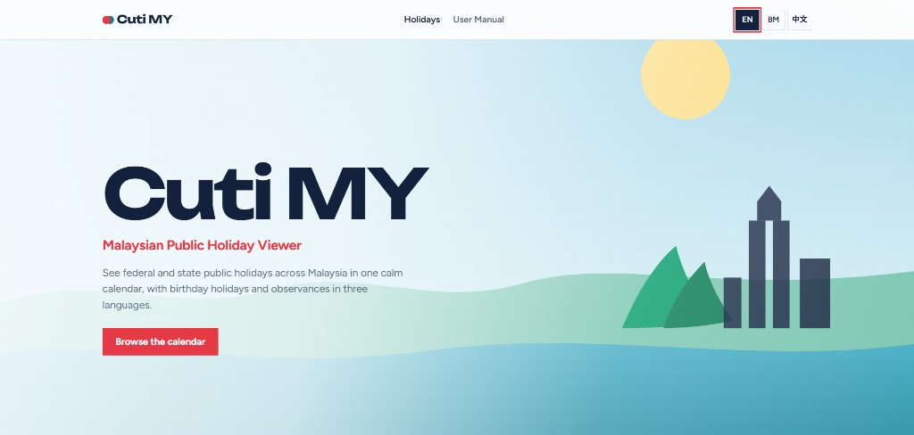

# Cuti MY – Malaysian Public Holiday Viewer

Browse federal, state, birthday and observance holidays in Malaysia — calendar view, live filters, and three languages (EN / BM / 中文).

## Quick start (XAMPP)

1. Place the project in `C:\xampp\htdocs\project\holiday_system`
2. Copy `config/db.example.php` to `config/db.php` and fill in your database credentials
3. Start **Apache** and **MySQL** in XAMPP
4. Create a MySQL database named `cuti_my` (charset `utf8mb4`) in phpMyAdmin
5. Open http://localhost/project/holiday_system/install.php
6. Click **Install now** to create tables and load 2024–2026 holiday data
7. Open http://localhost/project/holiday_system/index.php

Typical local database values:

| Field | Example |
| --- | --- |
| Host | `localhost` |
| Database | `cuti_my` |
| User | `root` |
| Password | your MySQL password (often empty on default XAMPP) |

```bash
copy config\db.example.php config\db.php
```

Then edit `config/db.php`. Do not commit real passwords — `config/db.php` is listed in `.gitignore`.

CLI install:

```bash
php install_cli.php
```

To run install again, delete `config/install.lock` or use:

```bash
php install_cli.php --force
```

Duplicate holiday rows are ignored.

## Features

- Malaysian public holiday calendar (4 columns desktop / 2 tablet / 1 mobile)
- Filter by year, month and type (Federal / State / Birthday / Observance)
- Live search by holiday name, state or description (AJAX + debounce)
- Statistics: total, federal, state, and next upcoming holiday
- Holiday detail modal (keyboard + Escape, accessible)
- English, Bahasa Melayu and Chinese UI
- Language preference saved in `localStorage`
- Seed data for **2024**, **2025** and **2026**
- Web installer (`install.php`) and CLI installer (`install_cli.php`)
- Trilingual user manual (`manual.php`)
- Shared-hosting ready (iFastNet / cPanel) — no Composer, Node.js or PHP framework

Holiday colour meaning:

- Teal = Federal
- Red = State
- Green = Birthday
- Grey = Observance

## Screenshots

| Home |
|:---:|
|  |

## Folder structure

```text
holiday_system/
├── index.php                 Homepage + calendar
├── install.php               Web installer
├── install_cli.php           Command-line installer
├── manual.php                User manual (EN / BM / 中文)
├── api/
│   └── holidays.php          JSON API (filters + stats)
├── assets/
│   ├── css/                  style.css, manual.css
│   ├── js/                   app.js, i18n.js, manual.js
│   └── img/                  Hero artwork
├── config/
│   ├── db.example.php        Example credentials (safe to commit)
│   └── db.php                Local credentials (gitignored)
├── docs/
│   └── screenshots/          README images
├── includes/
│   ├── HolidayService.php    Queries, filters, stats
│   ├── Installer.php         Install steps
│   ├── seed_holidays.php     Holiday seed data
│   ├── footer.php
│   └── init.php
├── sql/
│   ├── schema.sql            holidays table
│   ├── seed_data.php
│   └── desc_ms_map.php       Malay descriptions
└── LICENSE
```

## 1. XAMPP setup

1. Copy the project to `C:\xampp\htdocs\project\holiday_system`
2. Start **Apache** and **MySQL** in XAMPP
3. Create database `cuti_my` (utf8mb4)
4. Copy `config/db.example.php` to `config/db.php` and edit:

```php
$host = 'localhost';
$dbname = 'cuti_my';
$username = 'root';
$password = '';   // your MySQL password
```

`config/db.php` is gitignored so real credentials stay local.

5. Open: http://localhost/project/holiday_system/install.php
6. After success, open: http://localhost/project/holiday_system/index.php

If you prefer phpMyAdmin only:

1. Import `sql/schema.sql`
2. Run `php install_cli.php` (or the web installer) to load seed data
3. Easier path: just use `install.php`

## 2. Use the calendar

On the homepage:

1. Choose **Year** (All / 2024 / 2025 / 2026)
2. Choose **Month** (All or a single month)
3. Choose **Holiday type**
4. Type in **Search** (name, state, or description) — results update without a full page reload
5. Click a coloured date to open holiday details

Useful pages:

| Page | URL |
| --- | --- |
| Home | http://localhost/project/holiday_system/index.php |
| Manual | http://localhost/project/holiday_system/manual.php |
| Install | http://localhost/project/holiday_system/install.php |
| API example | http://localhost/project/holiday_system/api/holidays.php?year=2026&month=8&type=all&keyword= |

## 3. Languages

Use **EN / BM / 中文** in the header.

The choice is stored in the browser with `localStorage`, so it stays after refresh. It updates navigation, filters, weekday names, holiday names, descriptions, statistics, modal text and the user manual.

## 4. Adding future holidays

Holiday definitions live in `includes/seed_holidays.php`. Each holiday has a `dates` list.

To add **2027**:

1. Add the new date strings (for example `'2027-08-31'`) to the matching holiday
2. Add Malay text in `sql/desc_ms_map.php` only if you create a **new** holiday key
3. Delete `config/install.lock` if needed, then run `install.php` or `php install_cli.php --force`

Existing rows are protected by:

```sql
UNIQUE KEY unique_holiday (holiday_date, name_en)
```

Islamic dates may change with official moon sighting — update the seed file when the gazette changes.

## 5. Shared hosting (cPanel / iFastNet)

1. Create a MySQL database and user in cPanel
2. Upload the whole project into `public_html/` (or a subfolder)
3. Edit `config/db.php` with the cPanel database name and user
4. Open `install.php` in the browser
5. Open `index.php`

No Node.js, npm, Composer, Docker or Redis is required.

## 6. System flow

1. Visitor opens `index.php`
2. JavaScript calls `api/holidays.php` with year / month / type / keyword
3. `HolidayService` queries MySQL with PDO prepared statements
4. API returns holiday list + statistics + available years
5. Calendar, stats and language labels render in the browser
6. Clicking a date opens the detail modal

## 7. Security notes

- Database credentials stay in `config/db.php` only (never in JavaScript)
- All queries use PDO prepared statements
- API input is validated (year, month, type, keyword length)
- Page output is escaped with `htmlspecialchars`
- `config/`, `includes/` and `sql/` are blocked from direct web access by `.htaccess`
- Installer creates `config/install.lock` to reduce accidental reinstalls
- Production pages do not show raw MySQL/PHP errors to visitors

## 8. Troubleshooting

**Cannot connect to the database**  
Check host, database name, username and password in `config/db.php`. Confirm MySQL is running and the database exists.

**PDO MySQL is missing**  
Enable `extension=pdo_mysql` in `php.ini`, then restart Apache.

**Homepage says holidays could not be loaded**  
Run `install.php` first so the `holidays` table and seed data exist.

**Installer says already installed**  
Delete `config/install.lock` only if you intend to run setup again. Use `--force` with the CLI installer if needed.

**Chinese or Malay text looks broken**  
Use `utf8mb4` for the database and table.

**Search or filters do nothing**  
Enable JavaScript. Open the browser console and confirm `api/holidays.php` returns JSON.

**To reinstall from scratch**

1. Delete `config/install.lock`
2. Drop the `cuti_my` database in phpMyAdmin (optional but clean)
3. Recreate the database
4. Open `install.php` again

## License

This project is licensed under the [MIT License](LICENSE).
